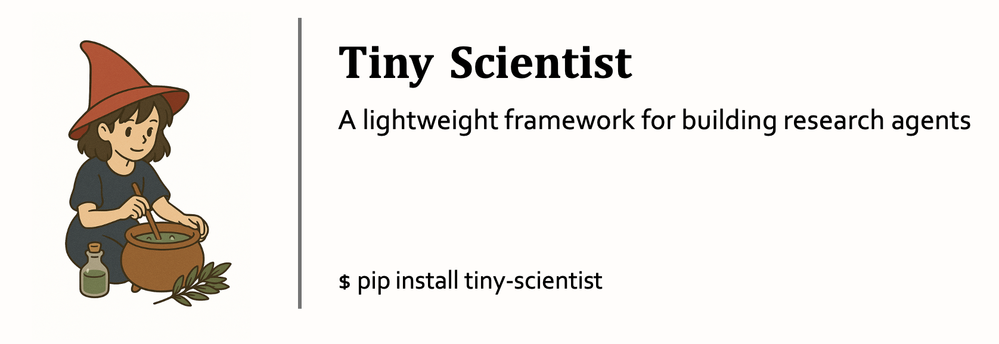

<div style="width: 100%;">
  </img>
</div>

<h1 align="center">TinyScientist: A Lightweight Framework for Building Research Agents</h1>

<div align="center">

[](https://www.python.org/downloads/release/python-3109/)
[](https://github.com/hiyouga/LLaMA-Factory/pulls)
[](https://pre-commit.com/)
[](https://beartype.readthedocs.io)
[](https://github.com/psf/black)

</div>

## Introduction

Welcome to **Tiny-Scientist**, Tiny-Scientist is an automated research agent framework that simulates the full lifecycle of a research process-—from ideation to implementation, paper writing, and review. This cutting-edge platform equips researchers with:

1. *End-to-End Automation*: Seamlessly generates novel research ideas, codes experiments, writes full papers, and conducts reviews—all powered by state-of-the-art LLMs.
2. *Modular Intelligence Agents*: Includes dedicated modules—Thinker, Coder, Writer, and Reviewer—each specialized for a distinct phase of the research workflow.
3. *Customizable and Extensible*: Designed for flexibility, allowing integration with various search tools and paper templates.

🔸 **Core Functions**

* 🧠 Think: Automatically generates innovative research ideas through iterative reasoning and refinement.
* 💻 Code: Translates research ideas into executable code with minimal human input. Supports experiment setup, baseline comparison.
* ✍️ Write: Generates full-length academic papers with well-structured sections, integrated citation management, and support for multiple conference templates.
* 📝 Review: Evaluates academic drafts using structured reviewing criteria inspired by top-tier conferences.


## Get started

### Install from pip

You can install `tiny-scientist` from `pypi` to use it as a package:

```bash
pip install tiny-scientist
```

### Install from scratch

Use a virtual environment to install all dependencies with one command `poetry install`:

```bash
conda create -n tiny-scientist python=3.10
conda activate tiny-scientist
curl -sSL https://install.python-poetry.org | python3
export PATH="$HOME/.local/bin:$PATH"
poetry install
```

### Config environment variables
Envrionment variables and database related configs are required to code successfully. The recommended way to set all the required values is to use the provided configuration template.

Step 1: Copy the defaulty configuration template
```bash
cp config.template.toml config.toml
```

Step 2: Fill in the Required Fields
```bash
vim config.toml
```

Step 3 (optional): Then fill in the necessary API keys and parameters. For example:
```bash
[core]
# S2 API Key for accessing scientific research data
s2_api_key = "your-semantic-scholar-api-key"
```
