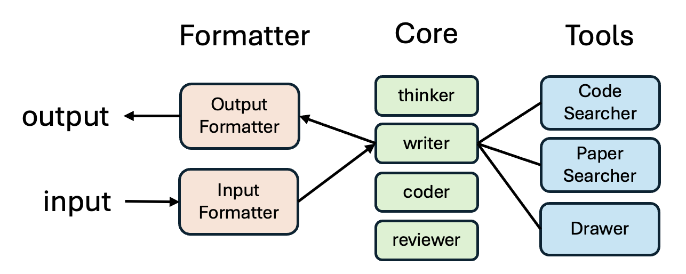

<div style="width: 100%;">
  </img>
</div>

<h1 align="center">TinyScientist: A Lightweight Framework for Building Research Agents</h1>

<div align="center">

[](https://pypi.org/project/tiny-scientist/)
[](https://www.python.org/downloads/release/python-3109/)
[](https://github.com/hiyouga/LLaMA-Factory/pulls)
[](https://pre-commit.com/)
[](https://beartype.readthedocs.io)
[](https://github.com/psf/black)

</div>

# Introduction

**Tiny-Scientist** is a lightweight, user-friendly framework for automating the entire lifecycle of scientific research—**from ideation to implementation, writing, and review**. Designed for flexibility, it integrates smoothly with your favorite LLMs and search tools.

#### Core Features

- 🧠 **Think**: Generate structured research ideas from an intent string.
- 💻 **Code**: Automatically generate and run experiments based on the idea.
- ✍️ **Write**: Convert your results and ideas into a conference-style paper.
- 📝 **Review**: Review any form of paper and output structured feedback in JSON.
- 🔧 **MCP**: The extensible tool use protocol by Anthropic

#### Software Architecture

Our codebase is structured around three core components to support an extensible framework: **core**, **tools**, and **formatters**. The **core** module provides essential functionalities, **tools** enhance and extend these core capabilities, and **formatters** handle input/output tasks such as LaTeX template rendering.

<p align="center">
  
</p>


# Installation

#### Option 1: Install via pip (recommended)

```bash
pip install tiny-scientist
```

#### Option 2: Install from source

```bash
# create conda environment
conda create -n tiny-scientist python=3.10
conda activate tiny-scientist

# Install Poetry
curl -sSL https://install.python-poetry.org | python3
export PATH="$HOME/.local/bin:$PATH"

# Install dependencies
poetry install
```

# Get started

Before running any code, set your API key:

```bash
export OPENAI_API_KEY=your-key-here
# or use DEEPSEEK_API_KEY, ANTHROPIC_API_KEY, or OPENROUTER_API_KEY
```

If you want to use local ollama models, set the API base:

```bash
export OLLAMA_API_BASE=http://192.168.23.11:11434
```

You can then specify ollama models like so: `ollama/llama3.2:latest` for example.

For LM Studio it is similar:

```bash
export LM_STUDIO_API_BASE=http://localhost:1234/v1
```

but you do need to specify an API key, even if it's a dummy value:

```bash
export LM_STUDIO_API_KEY=dummy-api-key
```

And the models are specified like so: `lm_studio/qwen2.5-coder-32b-instruct-mlx`

For other openAI compatible backend providers, set the following variables:

```bash
export OPENAI_API_BASE=http://192.168.9.14/v1
export OPENAI_API_KEY=your-key-here
```

and specify your model like so: `openai/qwen3-30b-a3b`

Now you can use Tiny-Scientist in Python with only a few lines of code:

```python
from tiny_scientist import TinyScientist

scientist = TinyScientist(model="gpt-4o")

# Step 1: Generate a json-format research idea
idea = scientist.think(intent="Benchmarking adaptive step size strategies using a convex quadratic optimization function")

# Step 2: Run experiments (you can provide baseline_results if available)
status, experiment_dir = scientist.code(idea=idea)

# if the experiments run successfully
if status is True:
    # Step 3: Write a paper
    pdf_path = scientist.write(idea=idea, experiment_dir=experiment_dir)

    # Step 4: Review the paper
    review = scientist.review(pdf_path=pdf_path)
```

# Managing API Keys (Optional)

You can configure keys using a `.toml` file for convenience beyond exporting.

#### Step 1: Copy the template

```bash
cp config.template.toml config.toml
```

#### Step 2: Fill in your API credentials

Edit `config.toml` to include your keys, such as:

```toml
[core]
llm_api_key = "xxxx"
```

No need to export environment variables manually—just set this once.

# Developing

#### Develop Demo
To develop a demo (Both frontend and backend):
```bash
python backend/app.py
```
```bash
cd frontend
npm install
npm start
```
# Q&A

If you face "cairo"-related errors, cario is a system-level dependency, please run `conda install -c conda-forge cairo` or `brew install cairo`.

If you face errors related to pdflatex, this is also a system-level dependency for latex rendering, please run `brew install --cask mactex`.

# Contribution

We’re working on extending support for more tools, models, and paper formats. Contributions welcome!

# Citation

```
@misc{tinyscientist,
author       = {Haofei Yu and Keyang Xuan and Fenghai Li and Kunlun Zhu and Zijie Lei and Jiaxun Zhang and Ziheng Qi and Jiaxuan You},
title        = {TinyScientist: A Lightweight Framework for Building Research Agents},
howpublished = {https://github.com/ulab-uiuc/tiny-scientist},
note         = {Accessed: 2025-04-14},
year         = {2025}
}
```
