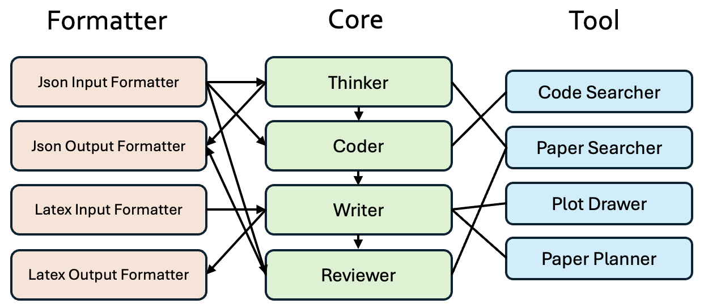

<div style="width: 100%;">
  </img>
</div>

<h1 align="center">TinyScientist: A Lightweight Framework for Building Research Agents</h1>

<div align="center">

[](https://pypi.org/project/tiny-scientist/)
[](https://www.python.org/downloads/release/python-3109/)
[](https://github.com/hiyouga/LLaMA-Factory/pulls)
[](https://pre-commit.com/)
[](https://beartype.readthedocs.io)
[](https://github.com/psf/black)

</div>

# Introduction

**Tiny-Scientist** is a lightweight, user-friendly framework for automating the entire lifecycle of scientific research—**from ideation to implementation, writing, and review**. Designed for flexibility, it integrates smoothly with your favorite LLMs and search tools.

#### Core Features

- 🧠 **Think**: Generate structured research ideas from an intent string.
- 💻 **Code**: Automatically generate and run experiments based on the idea.
- ✍️ **Write**: Convert your results and ideas into a conference-style paper.
- 📝 **Review**: Review any form of paper and output structured feedback in JSON.

#### Software Architecture

Our codebase is structured around three core components to support an extensible framework: **core**, **tools**, and **formatters**. The **core** module provides essential functionalities, **tools** enhance and extend these core capabilities, and **formatters** handle input/output tasks such as LaTeX template rendering.

<p align="center">
  
</p>


# Installation

#### Option 1: Install via pip (recommended)

```bash
pip install tiny-scientist
```

#### Option 2: Install from source

```bash
# create conda environment
conda create -n tiny-scientist python=3.10
conda activate tiny-scientist

# Install Poetry
curl -sSL https://install.python-poetry.org | python3
export PATH="$HOME/.local/bin:$PATH"

# Install dependencies
poetry install
```

# Get started

Before running any code, set your API key:

```bash
export OPENAI_API_KEY=your-key-here
# or use DEEPSEEK_API_KEY, ANTHROPIC_API_KEY, or OPENROUTER_API_KEY
```

Now you can use Tiny-Scientist in Python with only a few lines of code:

```python
from tiny_scientist import TinyScientist

scientist = TinyScientist(model="gpt-4o")

# Step 1: Generate a json-format research idea
idea = scientist.think(intent="Benchmarking adaptive step size strategies using a convex quadratic optimization function")

# Step 2: Run experiments (you can provide baseline_results if available)
status, experiment_dir = scientist.code(idea=idea)

# if the experiments run successfully
if status is True:
    # Step 3: Write a paper
    pdf_path = scientist.write(idea=idea, experiment_dir=experiment_dir)

    # Step 4: Review the paper
    review = scientist.review(pdf_path=pdf_path)
```

# Managing API Keys (Optional)

You can configure keys using a `.toml` file for convenience beyond exporting.

#### Step 1: Copy the template

```bash
cp config.template.toml config.toml
```

#### Step 2: Fill in your API credentials

Edit `config.toml` to include your keys, such as:

```toml
[core]
llm_api_key = "xxxx"
```

No need to export environment variables manually—just set this once.

# Q&A

If you face "cairo"-related errors, cario is a system-level dependency, please run `conda install -c conda-forge cairo` or `brew install cairo`.

If you face errors related to pdflatex, this is also a system-level dependency for latex rendering, please run `brew install --cask mactex`.

# Contribution

We're working on extending support for more tools, models, and paper formats. Contributions welcome!

# Citation

```
@misc{tinyscientist,
author       = {Haofei Yu and Keyang Xuan and Fenghai Li and Zijie Lei and Jiaxuan You},
title        = {TinyScientist: A Lightweight Framework for Building Research Agents},
howpublished = {https://github.com/ulab-uiuc/tiny-scientist},
note         = {Accessed: 2025-04-14},
year         = {2025}
}
```

# TinyScientist ReAct

This project extends TinyScientist with ReAct (Reasoning + Acting) capabilities for conducting domain-specific scientific experiments through a combination of LLM reasoning and specialized tool usage.

## Overview

The TinyScientist ReAct module allows you to:

1. Run experiments in specific domains (chemistry, physics, or general) using specialized scientific tools
2. Generate research papers based on experiment results
3. Produce scientific analyses with proper reasoning and methodology

## Requirements

- Python 3.8+
- Required packages (install via `pip install -r requirements.txt`)
- Access to OpenAI API or other supported LLM APIs

## Quick Start

The easiest way to run an experiment is using the provided bash script:

```bash
# Make the script executable
chmod +x run_experiment.sh

# Run a chemistry experiment
./run_experiment.sh --chemistry

# Run a physics experiment
./run_experiment.sh --physics

# Run a general experiment
./run_experiment.sh --general
```

## Advanced Usage

The bash script supports additional parameters:

```bash
./run_experiment.sh --help
```

Output:
```
Usage: run_experiment.sh [options]
Options:
  -h, --help              Show this help message
  -m, --model MODEL       Specify the LLM model (default: gpt-4o)
  -d, --domain DOMAIN     Set domain: chemistry, physics, general (default: general)
  -i, --intent TEXT       Specify experiment intent
  -o, --output DIR        Set output directory (default: ./output)
  --max-iter NUM          Set maximum iterations (default: 10)
  -t, --template FORMAT   Paper template: acl, iclr (default: acl)

Predefined experiment examples:
  --chemistry             Run chemistry experiment (solubility study)
  --physics               Run physics experiment (thermal-electrical property comparison)
  --general               Run general ML experiment
```

## Python API

You can also directly use the Python script:

```bash
python example_react_experiment.py --domain chemistry --intent "Investigate how temperature affects the solubility of NaCl in water"
```

Or import the TinyScientist class in your own code:

```python
from tiny_scientist import TinyScientist

scientist = TinyScientist(model="gpt-4o")
idea = scientist.think(intent="Your research question")
status, experiment_dir = scientist.react_experiment(
    idea=idea,
    domain="chemistry",
    max_iterations=15
)
```

## Available Domains and Tools

### Chemistry
- `MoleculeReactionTool`: Simulates chemical reactions between molecules
- `MoleculePropertyTool`: Retrieves properties of chemical compounds
- `SolubilityTool`: Determines solubility of compounds in various solvents

### Physics
- `KinematicsTool`: Calculates kinematic quantities in classical mechanics
- `ElectricalTool`: Calculates electrical quantities using Ohm's Law
- `ThermodynamicsTool`: Performs thermodynamic calculations and simulations

### General
- Includes all tools from both domains

## Example Workflow

1. The system generates a research idea based on your intent
2. The ReAct agent iteratively:
   - Reasons about the next step (Thought)
   - Selects and calls appropriate tools (Action)
   - Analyzes results (Observation)
3. Once the experiment is complete, a research paper is generated
4. A scientific review of the paper is provided

## Troubleshooting

- If tools aren't loading correctly, check that the `tiny_scientist/tools` directory contains the correct tool files
- For LLM API errors, verify your API keys are set correctly
- Experiment logs are saved in the output directory for debugging

## License

[MIT License](LICENSE)
